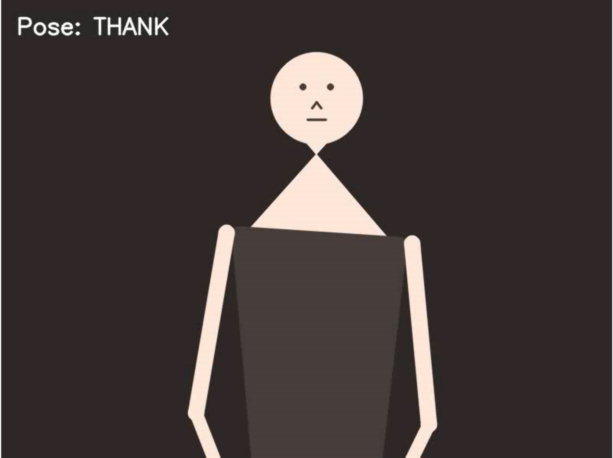
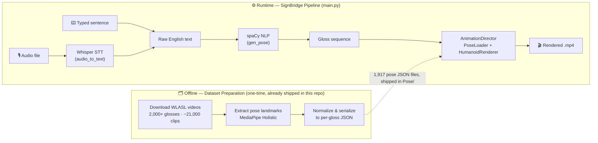
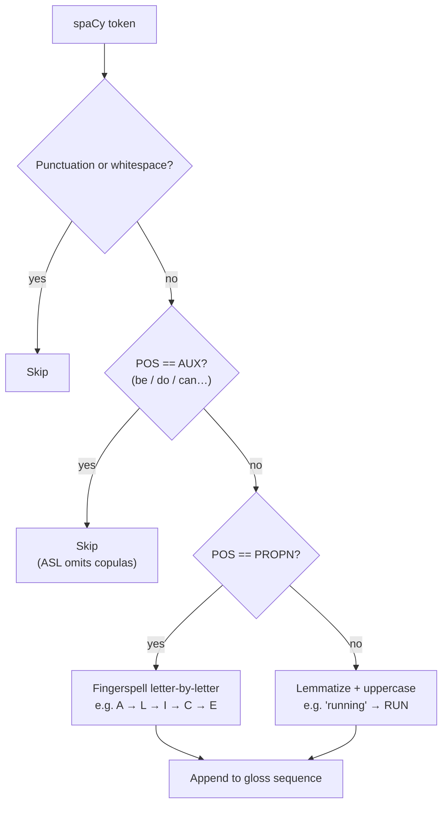
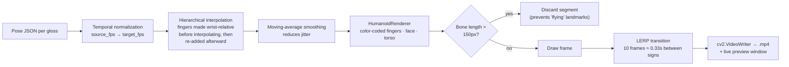
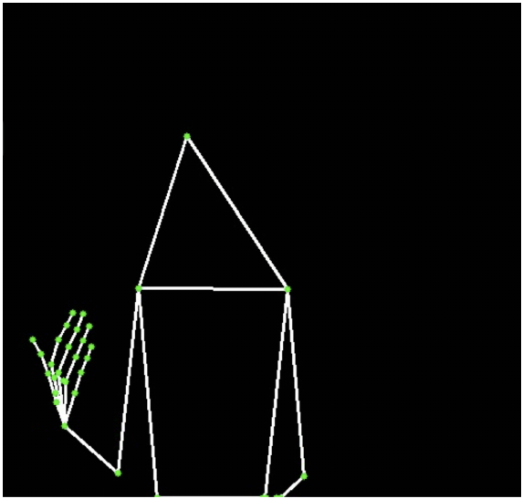
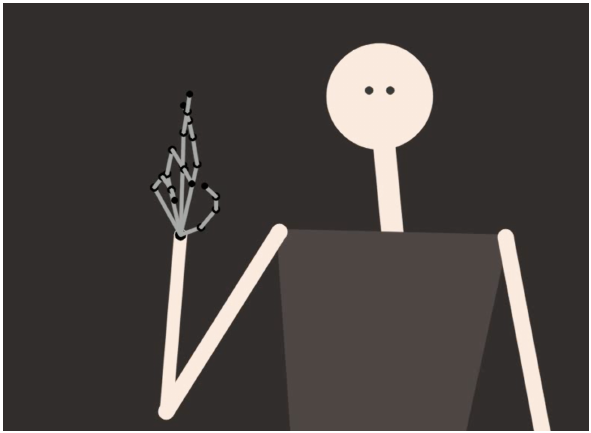
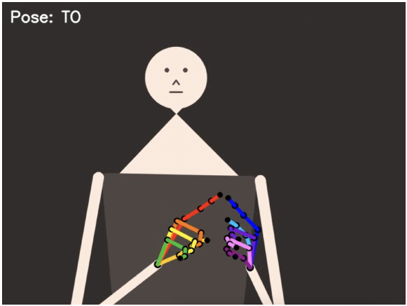

<div align="center">

# 🤟 SignBridge

### From voice to hands — an open-source pipeline that turns spoken or written English into animated American Sign Language.

Speak a sentence, or type one. SignBridge transcribes it, breaks it down the way ASL grammar actually works, and renders a color-coded animated avatar signing it back to you — fully offline, no cloud API keys required.

[](https://www.python.org/downloads/)
[](LICENSE)
[](#-getting-started)
[](https://github.com/openai/whisper)
[](https://spacy.io/)
[](https://opencv.org/)
[](#-contributing)

<br/>



<sub>A real frame rendered by SignBridge — the avatar mid-sign for <code>THANK</code>.</sub>

</div>

<br/>

## 📖 Table of Contents

- [What is SignBridge?](#-what-is-signbridge)
- [Key Features](#-key-features)
- [How It Works](#-how-it-works)
- [Under the Hood](#-under-the-hood)
- [The Dataset](#-the-dataset)
- [Performance](#-performance)
- [Getting Started](#-getting-started)
- [Usage Examples](#-usage-examples)
- [Project Structure](#-project-structure)
- [Limitations & Roadmap](#-limitations--roadmap)
- [Contributing](#-contributing)
- [Team & Acknowledgments](#-team--acknowledgments)
- [License](#-license)

<br/>

## 💡 What is SignBridge?

SignBridge is a from-scratch pipeline that bridges spoken/written English and American Sign Language (ASL). It doesn't just sign words one-for-one in English order — it applies real NLP to approximate ASL grammar (dropping auxiliary verbs, fingerspelling names) before animating a 2D avatar built entirely with NumPy, SciPy and OpenCV, using pose data derived from the [WLASL](https://github.com/dxli94/WLASL) dataset.

It started as a university engineering project and is now open-sourced end-to-end: dataset handling, NLP, and a custom animation renderer, all in plain, readable Python.

<br/>

## ✨ Key Features

- 🎙️ **Two input modes** — dictate a sentence via microphone/audio file, or type it directly
- 🧠 **Linguistically-aware gloss conversion** — spaCy drives auxiliary-verb dropping, fingerspelling, and lemmatization to approximate ASL grammar, not literal word-for-word English
- 🕺 **1,917 pre-extracted signs**, sourced from WLASL (2,000+ glosses, ~21,000 source videos, ~96% dictionary coverage achieved)
- 🖐️ **Color-coded, anatomically-constrained hands** — 5 distinct colors per hand, wrist-relative finger interpolation, jitter smoothing, and bone-length sanity checks to avoid glitchy renders
- 🎞️ **Smooth transitions between signs** — linear interpolation bridges every pair of consecutive glosses, avoiding jarring jump-cuts
- ⚡ **Fully local & offline** — Whisper + spaCy + OpenCV, no network calls, no API keys
- 🖥️ **One-command macOS/Linux setup**, guided Windows setup

<br/>

## 🏗️ How It Works



The top half (dataset preparation) already happened — its output is the `Pose/` folder shipped in this repo. The bottom half is what runs every time you use SignBridge.

**A worked example**, straight from the actual gloss-conversion logic:

| Input text | Gloss sequence produced |
|---|---|
| `"My name is Alice"` | `MY` `NAME` `A` `L` `I` `C` `E` — auxiliary *"is"* dropped, *"Alice"* fingerspelled letter-by-letter |
| `"I am running fast"` | `I` `RUN` `FAST` — auxiliary *"am"* dropped, *"running"* lemmatized to `RUN` |

<br/>

## 🔬 Under the Hood

### 1. NLP → Gloss Engine

`gen_pose()` walks every token from spaCy and routes it through a small decision tree designed to mimic how ASL grammar actually drops information that's implicit in the language:



### 2. Animation Engine

`animation_lib.py` cleanly separates data handling (`PoseLoader`), drawing (`HumanoidRenderer`) and orchestration (`AnimationDirector`). The trickiest part is keeping fingers physically attached to the hand while everything is being resampled to a new frame rate:



Why interpolate fingers relative to the wrist instead of in absolute screen coordinates? Because a fast arm movement would otherwise stretch or "detach" the fingers during resampling — converting to wrist-relative coordinates isolates the hand's own motion from the arm's motion in space before smoothing, then adds the arm's motion back afterward.

### 3. From wireframe to finished avatar

The rendering style went through several iterations before landing on the final look:

<table>
<tr>
<th>1. Skeletal prototype</th>
<th>2. Intermediate model</th>
<th>3. Final avatar</th>
</tr>
<tr>
<td></td>
<td></td>
<td></td>
</tr>
<tr>
<td>Debug wireframe — validating landmark connections</td>
<td>Early anthropomorphic pass — occlusion and finger ambiguity still unresolved</td>
<td>Final render — color-coded fingers, face, bone-length constraints</td>
</tr>
</table>

<br/>

## 🗃️ The Dataset

Pose data comes from **[WLASL](https://github.com/dxli94/WLASL)** (Word-Level American Sign Language) — one of the largest open ISLR (isolated sign language recognition) datasets, with 2,000+ glosses across ~21,000 source videos. An iterative "shortest video first" download heuristic (fall back to the next-shortest clip when the shortest is unavailable) reached ~96% dictionary coverage.

Each downloaded clip was processed with **MediaPipe Holistic** (57 raw landmarks: 15 body points + 21 per hand), then normalized with **Root Centering** — every landmark is expressed relative to the midpoint between the hips, so a sign looks identical whether the signer stood on the left or right of the frame. The result is serialized to one JSON file per gloss.

This entire process is **offline and one-time** — it already produced the 1,917 JSON files shipped in `Pose/`. You don't need to run it to use SignBridge.

<br/>

## 📊 Performance

Benchmarked across three machines spanning two architectures (x86_64 and Apple Silicon):

| Hardware | Whisper transcription | Video rendering (OpenCV) | NLP (spaCy) |
|---|---|---|---|
| Intel i5-8265U (8th gen) | 5.46s | **24.28s** | 0.10s |
| Intel i7-12700H | 2.97s | 31.47s | 0.02s |
| Apple M1 | **0.95s** | 36.44s | 0.02s |

| Hardware | Whisper threads | OpenCV rendering threads |
|---|---|---|
| Intel i5-8265U | 22 | 23 |
| Intel i7-12700H | 83 | **216** |
| Apple M1 | 5 | 6 |

> **Counter-intuitive finding:** the oldest chip (i5-8265U) renders video *faster* than either newer one. It's likely a combination of OpenCV/threading-library maturity on mature x86 code paths, and scheduling overhead from the i7's hybrid P-core/E-core architecture — it spawns 216 rendering threads vs. 22–23 on the i5 and just 5–6 on the M1's unified-memory design.
>
> Meanwhile, Apple Silicon dominates Whisper inference (0.95s vs 2.97–5.46s), consistent with its efficient unified memory and SIMD throughput. spaCy's NLP step is never a bottleneck on any platform.

<br/>

## 🚀 Getting Started

### Prerequisites

- **Python 3.9+**
- **[FFmpeg](https://ffmpeg.org/download.html)**, required by Whisper (install instructions per-OS below)
- No GPU, no API keys, no account — everything runs locally. `Pose/` (1,917 files) ships with the repo, so no dataset setup is needed.

<details>
<summary><strong>🍎 macOS / Linux</strong></summary>

```bash
# 1. Clone the repository, then move into it
git clone https://github.com/AndreaUnali/SignBridge.git
cd SignBridge

# 2. Grant execution permission to the setup script
chmod +x setup_mac.sh

# 3. Run it — creates a venv and installs everything (including checking for FFmpeg)
./setup_mac.sh

# 4. Activate the virtual environment
source venv/bin/activate

# 5. Launch the program
python3 main.py
```

If FFmpeg is missing, the script will point you to `brew install ffmpeg`.

</details>

<details>
<summary><strong>🪟 Windows</strong></summary>

```powershell
# 1. From the project folder, open PowerShell

# 2. Create the virtual environment
python -m venv venv

# 3. Activate it
.\venv\Scripts\activate

# If this errors out, run the line below once, then retry step 3:
# Set-ExecutionPolicy RemoteSigned -Scope CurrentUser

# 4. Install the dependencies
python .\install_deps.py

# 5. Launch the program
python main.py
```

> **Note:** `install_deps.py`'s FFmpeg check prints a macOS/Homebrew-specific hint even on Windows. If it reports FFmpeg missing, download it from [ffmpeg.org](https://ffmpeg.org/download.html) and add it to your `PATH` instead.

</details>

<br/>

## 🎬 Usage Examples

**Text mode:**

```
$ python3 main.py

--- Sign Language Animation Pipeline ---
1. Audio
2. Text
--> choice: 2

Enter the sentence to animate (natural language): My name is Alice and I like pizza
Rendering video: video_from_text.mp4...
Process completed successfully.
```

**Audio mode** — drop an audio file into `INPUT_AUDIO/` first (`.mp3`, `.wav`, `.flac`, `.ogg`, `.opus`, `.m4a`, `.aac` are all supported):

```
$ python3 main.py

--- Sign Language Animation Pipeline ---
1. Audio
2. Text
--> choice: 1

1. greeting.wav

Select file (number): 1
Processing audio: INPUT_AUDIO/greeting.wav
Detected text: Hello, nice to meet you
Rendering video: video_greeting.mp4...
Process completed successfully.
```

A live preview window opens during rendering — press `q` at any time to stop early.

<br/>

## 📁 Project Structure

```
SignBridge/
├── main.py             # CLI entry point: Whisper → spaCy → gloss pipeline
├── animation_lib.py    # PoseLoader / HumanoidRenderer / AnimationDirector
├── install_deps.py     # Cross-platform dependency installer
├── setup_mac.sh         # One-shot macOS/Linux setup script
├── requirements.txt     # Python dependencies
├── Pose/                 # 1,917 pre-extracted sign pose JSON files
├── INPUT_AUDIO/          # Drop your own audio files here for Audio mode
├── docs/images/           # README assets
└── Documentazione/        # Original academic report & presentation (Italian)
```

<br/>

## 🧭 Limitations & Roadmap

SignBridge is an honest work-in-progress — here's what it doesn't do yet:

- **Vocabulary is capped at 1,917 glosses/letters.** Words without a matching pose file are skipped with a console warning rather than approximated.
- **Grammar approximation is shallow.** Only auxiliary-verb dropping is handled — topic-comment structure and non-manual markers (eyebrow raises, head tilts for questions) aren't modeled.
- **The avatar is 2D and stylized**, not a photorealistic or 3D signer.
- **Rendering is CPU-bound** (see [Performance](#-performance)) — there's no GPU acceleration yet.

Ideas for contributors:
- [ ] GPU-accelerated rendering
- [ ] Expanded gloss coverage beyond WLASL
- [ ] Non-manual grammar markers (facial expression, head movement)
- [ ] A lightweight web-based player for the rendered videos
- [ ] Support for additional sign languages (e.g. LIS — Italian Sign Language)

<br/>

## 🤝 Contributing

Contributions, bug reports, and ideas are welcome! Feel free to open an [issue](../../issues) or a pull request. Adding missing glosses to `Pose/` or expanding grammar handling in `gen_pose()` are great places to start.

<br/>

## 👥 Team & Acknowledgments

Built by **Andrea Fiori**, **Matteo Pedoni**, and **Andrea Unali** as an engineering project at the *Università degli Studi di Sassari*, Department of Engineering.

This project stands on the shoulders of:

- [WLASL](https://github.com/dxli94/WLASL) — Word-Level American Sign Language dataset
- [MediaPipe Holistic](https://github.com/google-ai-edge/mediapipe) — landmark extraction (Google)
- [OpenAI Whisper](https://github.com/openai/whisper) — speech-to-text
- [spaCy](https://spacy.io/) — natural language processing (Explosion AI)
- [OpenCV](https://opencv.org/) — video rendering

<br/>

## 📄 License

Released under the [MIT License](LICENSE).

<br/>

<div align="center">

**⭐ If you found this interesting, consider starring the repo — it helps others discover the project.**

[Back to top](#-signbridge)

</div>
